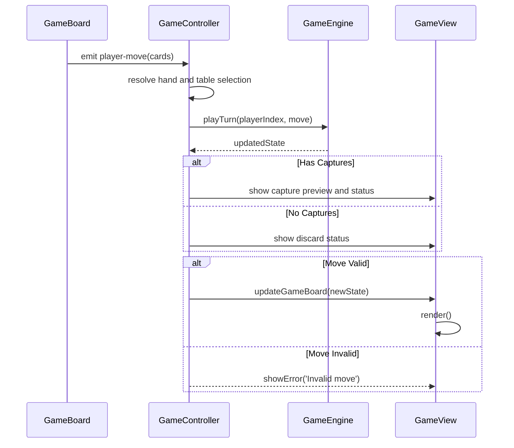
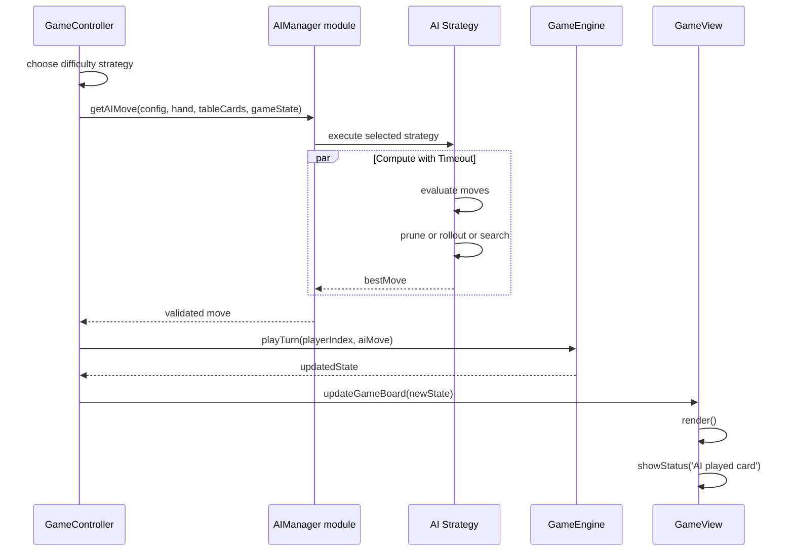

# Software Architecture Runtime

## Data Flow

### Game Initialization

```text
index.html
    ↓
index.js (bootstrapper)
    ↓
load configuration and messages modules
    ↓
create initial game state and engine
    ↓
GameView/GameUI render + menu initialization
```

Startup wires the view layer, engine, configuration, and UI event handling. The
original architecture assumed JSON configuration loading; the current code uses
module-based configuration objects while preserving the same runtime role.

### Shell and Overlay Runtime Flow

```text
index.js initializes side panel and overlay pages
    ↓
User opens Options overlay
    ↓
Current settings snapshot captured (rule profile, strategy, timing, playerTypes)
    ↓
User changes profile/strategy/timing and/or per-seat player type
    ↓
Overlay closes and settings diff is evaluated
    ↓
If changed: GameController.startNewGame(updatedConfig)
    ↓
Badge and board rerender with updated turn/score/player-type context
```

The app shell in `index.js` is responsible for this outer navigation flow, while
`GameController` continues to own move validation and turn progression.

### Turn Execution (Human Player)

```text
GameView or GameBoard (user clicks card)
    ↓
selection handled by GameBoard and GameController
    ↓
Available captures validated
    ↓
User selects capture set (or discard)
    ↓
GameEngine.playTurn(playerIndex, move)
    ↓
Updated GameState propagated to view
    ↓
GameView.render(newState)
```

### Scopa Resolution Rule Flow (FR-6.3 + FR-6.4 + FR-11.3)

```text
Capture resolves and removes selected table cards
    ↓
If table not empty: not a scopa
    ↓
If table empty: check shared scopa-scoring helper
    ↓
Automatic final table award at round end? never scopa
    ↓
Otherwise, if option "no scopa on final card" is enabled:
    if hand empty AND stock exhausted => no scopa
    else => scopa counts normally
```

### Turn Execution (AI Player)

```text
GameView detects AI turn
    ↓
GameController selects configured AI strategy
    ↓
getAIMove(playerConfig, hand, tableCards, gameState)  [async]
    ↓
Selected strategy executes with timeout validation
    ↓
Promise resolves with validated move
    ↓
GameEngine.playTurn(playerIndex, aiMove)
    ↓
Updated GameState propagated to view
    ↓
GameView.render(newState) after configured timeout
```

### Round Scoring

```text
GameState detects round end (stock exhausted, all cards played)
    ↓
Award final table cards to last capturer
    ↓
ScoringEngine.scoreRound(gameState)
    ↓
Statistics manager records scores, scope, winner
    ↓
Statistics view or panel updates
    ↓
Check win condition
    ↓
If not game-over: deal next round
    ↓
If game-over: show results and reset flow
```

In addition to engine-managed scoring transitions, the repository contains
`core/round-end.js` helper functions for final card awards, completion checks,
and scoring-phase transition helpers used by dedicated round-end tests.

### Rule Profile and Win-Condition Resolution Flow

```text
Load configuration profile (classic_scopa or digital_default)
    ↓
Resolve effective options (targetScore, primieraMethod, final-card scopa toggle,
minimum-lead variant)
    ↓
Run rounds and scoring with resolved options
    ↓
GameEngine evaluates win condition using targetScore and minimumLead (default: 2)
    ↓
Terminal state entered only when active profile win criteria are satisfied
```

### Deterministic Test/Replay Shuffle Flow (FR-17.5)

```text
Game start or replay setup
    ↓
If deterministicShuffle.enabled is false: use normal shuffle
    ↓
If deterministicShuffle.enabled is true: initialize seeded RNG
    ↓
Deck.shuffle() consumes seeded RNG sequence
    ↓
Repeat with same seed/profile/config yields identical deck order
```

---

## Component Interactions

### Event Bus Pattern (Observer)

```javascript
// index.js
const eventBus = new EventBus()

// GameView publishes user actions
eventBus.on("difficulty-selected", (data) => {
  // Controller starts a new game
})

// Game logic publishes state changes
eventBus.on("player-move", (data) => {
  // Controller resolves the move and updates the view
})
```

The exact wiring has evolved, but the architectural intent remains the same:
user intent is separated from state mutation and render refresh.

### Immutable State Updates

```javascript
// Old state is never modified
const oldState = gameState

const newState = oldState.transition("captureDisplay", {
  captureDisplay: {
    playedCard: cardInstance,
    tableCards: [card1, card2],
    playerId: 1
  }
})

// Controller or view code can now consume the replacement state
gameView.render(newState)
```

### Human Turn Sequence Diagram



### AI Turn Sequence Diagram (Async)



### Results and Statistics Persistence Flow

```text
GameController detects game end
    ↓
GameView renders results screen
    ↓
StatisticsPanel.recordGame(difficulty, won, playerScore)
    ↓
StatisticsPanel.saveStats()
    ↓
localStorage key scopa_stats updated
```

This flow is currently browser-local persistence at UI level rather than a
backend or shared profile store.

### PWA Install and Offline Runtime Flow

```text
index.js bootstraps app shell
    ↓
registerServiceWorker() registers ./sw.js on window load
    ↓
Service worker install event caches shell assets
    ↓
Browser evaluates manifest + service worker installability criteria
    ↓
User triggers install via browser UI (menu/install icon/Add to Home Screen)
```

Offline behavior at runtime:

- **Navigation requests**: network-first with fallback to cached `index.html`.
- **Static assets** (`script`, `style`, `image`, `worker`, `font`):
  stale-while-revalidate in runtime cache.
- **Cache versioning**: old cache buckets are removed during service worker
  activation.

---

## AI Strategy Integration

### Strategy Selection Flow

1. User opens options and chooses either an explicit AI strategy or a preset
    that maps deterministically to one.
2. User sets AI response time and other related options.
3. Runtime configuration is validated and stored for the active session.
4. Turn routing uses the resolved strategy (`greedy`, `negamax`, or `mcts`).

### AI Move Computation (Async)

1. **GameController** detects that the active player is AI-controlled.
2. **GameController** selects the active strategy from the configured difficulty
   mapping.
3. Selected strategy runs through the AI manager validation path:
   - **Greedy**: completes quickly
   - **Negamax**: iterative deepening bounded by response timeout
   - **MCTS**: rollout count + timeout bounded
4. The validated move is returned to the engine.
5. Main thread applies move to GameState.
6. UI updates without blocking.

`workers/ai-worker.js` is the asynchronous execution path when enabled by the
runtime; implementations may fall back to main-thread async scheduling while
preserving non-blocking behavior and timeout guarantees.
